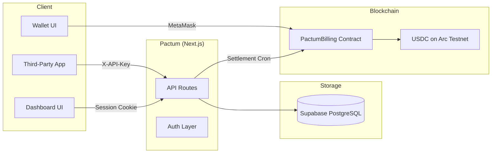

# Pactum Documentation

Technical documentation for the Pactum billing platform.

---

## Contents

| Document | Description |
|---|---|
| [Architecture](./architecture.md) | System overview, component relationships, and data flow diagrams |
| [Setup](./setup.md) | Local development environment setup and configuration |
| [Database](./database.md) | Schema reference, entity relationships, and migration guide |
| [API Reference](./api-reference.md) | Complete REST API documentation with request/response examples |
| [Smart Contract](./smart-contract.md) | PactumBilling Solidity contract reference |
| [Settlement](./settlement.md) | End-to-end off-chain to on-chain settlement flow |
| [Integration Guide](./integration-guide.md) | Guide for third-party developers integrating with the Pactum API |
| [Deployment](./deployment.md) | Vercel deployment, environment configuration, and cron setup |

---

## Architecture at a Glance

