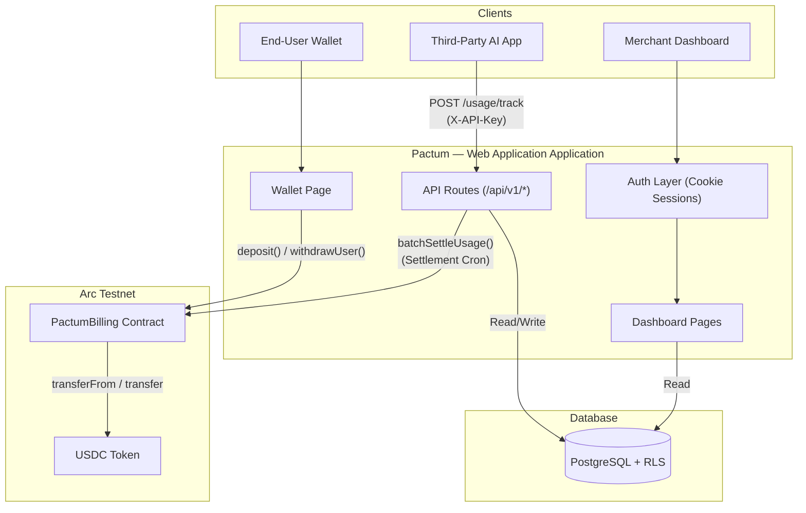
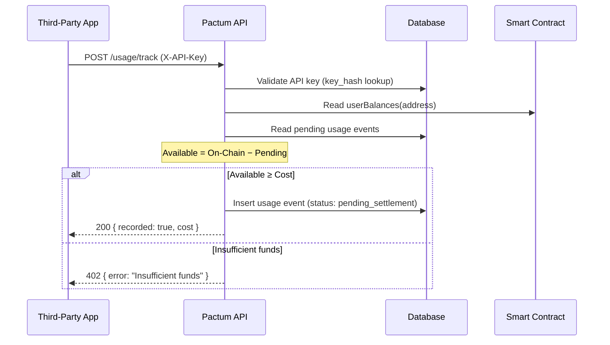
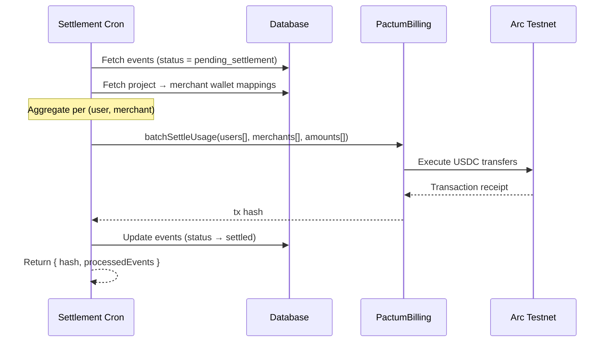

# Architecture

## System Overview

Pactum is a three-tier system: a Web Application application serving both the dashboard UI and the REST API, Database as the persistence layer, and Arc Testnet as the settlement layer.



---

## Component Relationships

### Authentication

The system uses two separate authentication mechanisms:

| Context | Mechanism | Details |
|---|---|---|
| **Dashboard** (merchant) | Session cookie | Email/password login with bcrypt hashing. Session stored as `pactum_session` cookie containing the user ID. |
| **SDK/API** (third-party) | API key header | `X-API-Key` header containing a `pactum_`-prefixed key. The key is SHA-256 hashed and looked up in `api_keys_pactum`. |

### Data Flow — Usage Tracking



### Data Flow — Settlement



---

## Technology Stack

| Layer | Technology | Purpose |
|---|---|---|
| Frontend | Web Application 16, React 19, Tailwind CSS | Dashboard UI and wallet pages |
| Backend | Web Application API Routes | RESTful API endpoints (serverless) |
| Database | Database (PostgreSQL) | Data persistence with Row Level Security |
| Authentication | bcryptjs, HTTP-only cookies | Dashboard session management |
| Blockchain | Arc Testnet | On-chain settlement layer (USDC-native gas) |
| Smart Contract | Solidity 0.8.20 | PactumBilling — deposit, settlement, withdrawal |
| On-chain Client | viem | Contract interactions from the backend |
| Styling | Tailwind CSS, custom design tokens | Ledger-inspired visual language |

---

## Directory Structure

```
pactum/
├── app/
│   ├── api/
│   │   ├── auth/                 # Login and signup endpoints
│   │   └── v1/
│   │       ├── usage/track/      # Usage event recording (SDK endpoint)
│   │       ├── keys/             # API key CRUD
│   │       ├── policies/         # Spend policy management
│   │       ├── invoices/         # Invoice generation and listing
│   │       ├── settlement/cron/  # On-chain batch settlement trigger
│   │       ├── settle/           # Manual settlement trigger
│   │       ├── wallet/balance/   # Off-chain pending usage balance
│   │       └── receipts/[id]/    # Settlement receipt details
│   ├── dashboard/
│   │   ├── page.tsx              # Overview with live usage stats
│   │   ├── usage/                # Detailed usage analytics
│   │   ├── payouts/              # Settlement history and withdrawal
│   │   └── settings/             # Project settings, API keys, wallet config
│   ├── wallet/                   # End-user USDC deposit page
│   ├── login/                    # Email/password login
│   └── signup/                   # Registration
├── contracts/
│   └── PactumBilling.sol         # Core billing smart contract
├── lib/
│   ├── arc/config.ts             # Arc Testnet chain configuration and ABIs
│   ├── Database/                 # Database client (browser + admin)
│   ├── api-keys.ts               # Key generation, hashing, validation
│   ├── auth.ts                   # Password hashing, session cookies
│   └── invoices.ts               # Invoice aggregation logic
├── components/                   # Shared React UI components
├── database/migrations/          # SQL migration files (run in order)
└── tokens.css                    # Design token definitions
```

---

## Key Design Decisions

### Off-Chain Metering, On-Chain Settlement

Usage events are recorded in PostgreSQL (Database) for speed and cost efficiency. Individual API calls do not produce on-chain transactions. Instead, usage is aggregated and settled in batches via the `batchSettleUsage` contract function. This keeps per-request latency low while maintaining on-chain auditability.

### State Channel Pattern

The system implements a State Channel pattern:
1. Users deposit USDC into the PactumBilling smart contract.
2. API usage is tracked off-chain with balance checks against both the on-chain deposit and accumulated pending usage.
3. A settlement cron aggregates pending events and executes a single on-chain batch transfer.
4. After settlement, usage event statuses transition from `pending_settlement` to `settled`.

### Secure Backend Gateway

All database access is strictly routed through the Web Application API layer. Direct client database access is blocked at the infrastructure level, ensuring that sensitive data operations are fully controlled and audited by the application backend.
