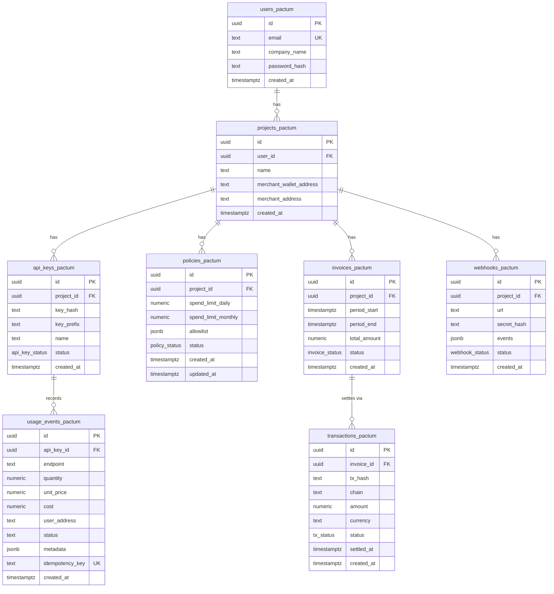

# Database

Schema reference and migration guide for the Pactum platform.

All data is stored in Supabase (PostgreSQL). The backend uses the service role key to bypass RLS for all operations.

---

## Entity-Relationship Diagram

---

## Table Reference

### `users_pactum`

Registered merchant accounts.

| Column | Type | Constraints | Description |
|---|---|---|---|
| `id` | `uuid` | PK, default `gen_random_uuid()` | User identifier |
| `email` | `text` | NOT NULL, UNIQUE | Login email |
| `company_name` | `text` | — | Organization name |
| `password_hash` | `text` | — | bcrypt hash of the user password |
| `created_at` | `timestamptz` | default `now()` | Registration timestamp |

---

### `projects_pactum`

Each user owns one or more projects. A project groups API keys, policies, and invoices.

| Column | Type | Constraints | Description |
|---|---|---|---|
| `id` | `uuid` | PK, default `gen_random_uuid()` | Project identifier |
| `user_id` | `uuid` | FK → `users_pactum(id)`, CASCADE | Owner |
| `name` | `text` | NOT NULL | Project display name |
| `merchant_wallet_address` | `text` | — | Wallet address for USDC settlement payouts |
| `merchant_address` | `text` | — | Alternative merchant address field |
| `created_at` | `timestamptz` | default `now()` | Creation timestamp |

---

### `api_keys_pactum`

API keys used by third-party applications to authenticate usage tracking requests.

| Column | Type | Constraints | Description |
|---|---|---|---|
| `id` | `uuid` | PK | Key record identifier |
| `project_id` | `uuid` | FK → `projects_pactum(id)`, CASCADE | Parent project |
| `key_hash` | `text` | NOT NULL | SHA-256 hash of the full API key |
| `key_prefix` | `text` | NOT NULL | Display prefix (e.g., `pactum_a1b2c3d4`) |
| `name` | `text` | default `'Default'` | Human-readable label |
| `status` | `api_key_status` | default `'active'` | `active` or `revoked` |
| `created_at` | `timestamptz` | default `now()` | Generation timestamp |

> [!NOTE]
> The full API key is only returned once at creation time. It is never stored in plaintext.

---

### `policies_pactum`

Spend policies that define limits per project.

| Column | Type | Constraints | Description |
|---|---|---|---|
| `id` | `uuid` | PK | Policy identifier |
| `project_id` | `uuid` | FK → `projects_pactum(id)`, CASCADE | Target project |
| `spend_limit_daily` | `numeric(18,6)` | default `100.000000` | Maximum daily spend in USDC |
| `spend_limit_monthly` | `numeric(18,6)` | default `3000.000000` | Maximum monthly spend in USDC |
| `allowlist` | `jsonb` | default `'[]'` | Allowed endpoint patterns |
| `status` | `policy_status` | default `'active'` | `active` or `inactive` |
| `created_at` | `timestamptz` | default `now()` | Creation timestamp |
| `updated_at` | `timestamptz` | default `now()` | Last modification |

---

### `usage_events_pactum`

Individual usage records from API consumers. Each record represents one metered API call.

| Column | Type | Constraints | Description |
|---|---|---|---|
| `id` | `uuid` | PK | Event identifier |
| `api_key_id` | `uuid` | FK → `api_keys_pactum(id)`, CASCADE | Source API key |
| `endpoint` | `text` | NOT NULL | Model or endpoint name |
| `quantity` | `numeric(18,6)` | default `1.000000` | Total token count |
| `unit_price` | `numeric(18,6)` | NOT NULL | Average price per token |
| `cost` | `numeric(18,6)` | NOT NULL | Total cost (quantity × unit_price) |
| `user_address` | `text` | — | End-user wallet address |
| `status` | `text` | default `'pending_settlement'` | `pending_settlement` or `settled` |
| `metadata` | `jsonb` | default `'{}'` | Token breakdown, app info |
| `idempotency_key` | `text` | NOT NULL, UNIQUE | Prevents duplicate recording |
| `created_at` | `timestamptz` | default `now()` | Event timestamp |

**Indexes:**
- `idx_usage_api_key` on `api_key_id`
- `idx_usage_created` on `created_at`
- Unique constraint on `idempotency_key`

---

### `invoices_pactum`

Aggregated billing invoices for a project over a time period.

| Column | Type | Constraints | Description |
|---|---|---|---|
| `id` | `uuid` | PK | Invoice identifier |
| `project_id` | `uuid` | FK → `projects_pactum(id)`, CASCADE | Parent project |
| `period_start` | `timestamptz` | NOT NULL | Billing period start |
| `period_end` | `timestamptz` | NOT NULL | Billing period end |
| `total_amount` | `numeric(18,6)` | default `0.000000` | Sum of usage costs |
| `status` | `invoice_status` | default `'draft'` | `draft` → `finalized` → `settling` → `settled` / `failed` |
| `created_at` | `timestamptz` | default `now()` | Creation timestamp |

---

### `transactions_pactum`

On-chain settlement transaction records.

| Column | Type | Constraints | Description |
|---|---|---|---|
| `id` | `uuid` | PK | Transaction record identifier |
| `invoice_id` | `uuid` | FK → `invoices_pactum(id)`, CASCADE | Associated invoice |
| `tx_hash` | `text` | — | On-chain transaction hash |
| `chain` | `text` | default `'arc-testnet'` | Target blockchain |
| `amount` | `numeric(18,6)` | NOT NULL | Settlement amount in USDC |
| `currency` | `text` | default `'USDC'` | Currency identifier |
| `status` | `tx_status` | default `'pending'` | `pending` → `submitted` → `confirmed` / `failed` |
| `settled_at` | `timestamptz` | — | Confirmation timestamp |
| `created_at` | `timestamptz` | default `now()` | Record creation timestamp |

---

### `webhooks_pactum`

Webhook endpoints for event notifications.

| Column | Type | Constraints | Description |
|---|---|---|---|
| `id` | `uuid` | PK | Webhook identifier |
| `project_id` | `uuid` | FK → `projects_pactum(id)`, CASCADE | Parent project |
| `url` | `text` | NOT NULL | Destination URL |
| `secret_hash` | `text` | NOT NULL | HMAC signing secret (hashed) |
| `events` | `jsonb` | default `'["usage.recorded", ...]'` | Subscribed event types |
| `status` | `webhook_status` | default `'active'` | `active` or `inactive` |
| `created_at` | `timestamptz` | default `now()` | Registration timestamp |

---

## Custom Enum Types

| Enum | Values |
|---|---|
| `api_key_status` | `active`, `revoked` |
| `policy_status` | `active`, `inactive` |
| `invoice_status` | `draft`, `finalized`, `settling`, `settled`, `failed` |
| `tx_status` | `pending`, `submitted`, `confirmed`, `failed` |
| `webhook_status` | `active`, `inactive` |

---

## Migrations

Migration files are located in `supabase/migrations/`. Execute them in order via the Supabase SQL Editor.

| File | Description |
|---|---|
| `001_initial_schema.sql` | Creates all core tables, enums, RLS policies, and realtime subscriptions |
| `002_custom_auth.sql` | Migrates from Supabase Auth to custom email/password auth. Drops original RLS policies, adds `password_hash` column |
| `003_state_channel.sql` | Adds `status` and `user_address` columns to `usage_events_pactum` for state channel billing |
| `004_enable_rls.sql` | Re-enables RLS on all tables (backend uses service role key to bypass) |

---

## Row Level Security Strategy

RLS is **enabled** on all tables. However, no user-facing RLS policies are currently active. The backend exclusively uses the **Supabase service role key** (`createAdminClient`), which bypasses RLS entirely. This means:

- Direct database access from anonymous or authenticated Supabase clients is **blocked** by default.
- All data access is controlled through the API routes, which handle authorization via session cookies or API key validation.
- This approach simplifies policy management while maintaining database-level security.
