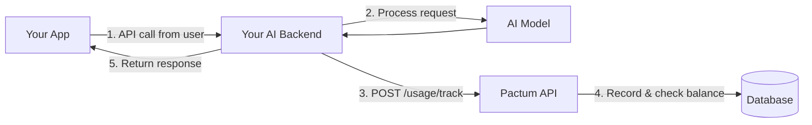

# Integration Guide

Guide for third-party developers integrating their applications with the Pactum billing API.

---

## Overview

Pactum provides a REST API that enables AI service providers to track per-token usage and settle payments in USDC. Integration involves three steps:

1. **Setup** — Create a Pactum account and generate an API key.
2. **Track** — Call the usage tracking endpoint after each API request.
3. **Settlement** — Pactum handles on-chain settlement automatically.



---

## Step 1: Create Account and API Key

1. Sign up at the Pactum dashboard.
2. Navigate to **Settings → API Keys**.
3. Click **Generate New Key**.
4. Copy the full API key immediately — it is only shown once.

The key format is: `pactum_<40 hex characters>`

---

## Step 2: Track Usage

After your application processes a user request, report the usage to Pactum.

### Request

```bash
curl -X POST https://your-pactum-instance.vercel.app/api/v1/usage/track \
  -H "Content-Type: application/json" \
  -H "X-API-Key: pactum_your_api_key_here" \
  -d '{
    "model": "deepseek-chat",
    "prompt_tokens": 250,
    "completion_tokens": 120,
    "prompt_price_per_token": 0.000005,
    "completion_price_per_token": 0.000015,
    "user_address": "0xUserWalletAddress",
    "idempotency_key": "unique-request-id-123",
    "metadata": {
      "app": "my-chat-app",
      "conversation_id": "conv-789"
    }
  }'
```

### Response

```json
{
  "recorded": true,
  "deduplicated": false,
  "event_id": "550e8400-e29b-41d4-a716-446655440000",
  "cost": 0.003050
}
```

### Code Example (Node.js)

```javascript
async function trackUsage({ promptTokens, completionTokens, userAddress, requestId }) {
  const response = await fetch(`${PACTUM_API_URL}/usage/track`, {
    method: "POST",
    headers: {
      "Content-Type": "application/json",
      "X-API-Key": process.env.PACTUM_API_KEY,
    },
    body: JSON.stringify({
      model: "your-model-name",
      prompt_tokens: promptTokens,
      completion_tokens: completionTokens,
      prompt_price_per_token: 0.000005,
      completion_price_per_token: 0.000015,
      user_address: userAddress,
      idempotency_key: requestId,
    }),
  });

  const data = await response.json();

  if (response.status === 402) {
    // User has insufficient funds
    throw new Error("User balance too low. Ask them to deposit USDC.");
  }

  if (!response.ok) {
    throw new Error(`Pactum error: ${data.error}`);
  }

  return data;
}
```

---

## Step 3: Handle Insufficient Funds

When a user's available balance is too low, the API returns `402 Payment Required`:

```json
{
  "error": "Insufficient funds in State Channel.",
  "details": "On-chain: 0.500000 USDC, Pending: 0.498000 USDC, Required: 0.003050 USDC"
}
```

Your application should:
1. Stop processing the request (do not call the AI model).
2. Inform the user that they need to deposit more USDC.
3. Optionally, redirect them to the Pactum wallet page to deposit funds.

---

## Idempotency

Every usage tracking request **must** include a unique `idempotency_key`. This prevents double-charging in case of network retries or duplicate requests.

**Best practices:**
- Use the request ID from your application (e.g., `req-${uuid}`).
- Include a timestamp component to avoid collisions (e.g., `chat-${Date.now()}-${randomHex}`).
- If a duplicate key is detected, Pactum returns the original event without creating a new charge.

```json
{
  "recorded": true,
  "deduplicated": true,
  "event_id": "original-event-uuid",
  "cost": 0.003050
}
```

---

## Error Reference

| Status | Error | Action |
|---|---|---|
| `400` | Missing required fields | Include `model`, `user_address`, and `idempotency_key` |
| `401` | Missing or invalid API key | Check `X-API-Key` header format |
| `402` | Insufficient funds | User must deposit USDC to the PactumBilling contract |
| `403` | API key revoked | Generate a new API key from the dashboard |
| `500` | Server error | Retry with the same `idempotency_key` |

---

## Integration Checklist

- [ ] Create a Pactum account and project
- [ ] Generate and securely store an API key
- [ ] Configure your application to call `/usage/track` after each billable request
- [ ] Include unique `idempotency_key` values in every request
- [ ] Handle `402` responses (insufficient funds)
- [ ] Set a merchant wallet address in Settings for settlement payouts
- [ ] Verify usage events appear in the Pactum dashboard
- [ ] Configure settlement schedule (manual or automated cron)
