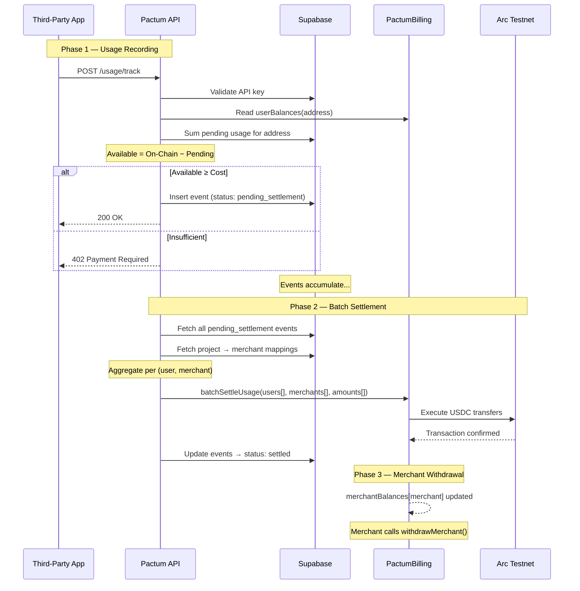
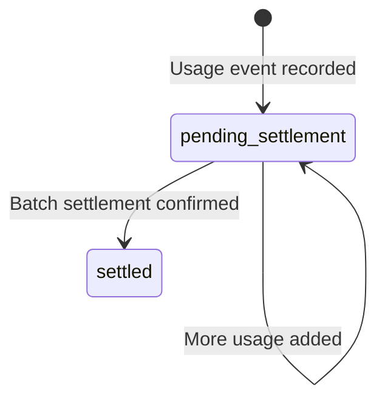

# Settlement

End-to-end settlement flow: from off-chain usage tracking to on-chain USDC transfers.

---

## Overview

Pactum uses a **State Channel** pattern for billing:
1. Usage is metered **off-chain** in PostgreSQL for speed and cost efficiency.
2. Settlement happens **on-chain** via the PactumBilling smart contract in aggregated batches.

This design keeps per-request latency low (no blockchain calls during API usage) while maintaining full on-chain auditability for completed settlements.

---

## End-to-End Flow



---

## Phase 1: Off-Chain Usage Recording

When a third-party app calls `POST /api/v1/usage/track`:

1. **API Key Validation** — The `X-API-Key` header is SHA-256 hashed and looked up in `api_keys_pactum`.
2. **Balance Pre-Check** — The system reads the user's on-chain USDC deposit from the PactumBilling contract and subtracts all pending (unsettled) off-chain usage to determine the available balance.
3. **Sufficiency Check** — If available balance ≥ calculated cost, the usage event is recorded with `status: pending_settlement`. Otherwise, a `402` is returned.
4. **Idempotency** — The `idempotency_key` prevents duplicate recording. If a key already exists, the original event is returned without creating a new one.

### Cost Calculation

```
cost = (prompt_tokens × prompt_price_per_token) + (completion_tokens × completion_price_per_token)
```

### Available Balance Formula

```
available = on_chain_deposit − sum(pending_usage_costs)
```

This formula ensures users cannot spend more than they have deposited, even before settlement occurs.

---

## Phase 2: Batch Settlement

Settlement is triggered by calling `POST /api/v1/settlement/cron` with a valid `CRON_SECRET` bearer token.

### Aggregation

The settlement process:

1. Fetches all `usage_events_pactum` records with `status = 'pending_settlement'`.
2. Joins through `api_keys_pactum` → `projects_pactum` to resolve each event's merchant wallet address.
3. Aggregates costs by unique `(user_address, merchant_wallet_address)` pairs.

### On-Chain Execution

A single `batchSettleUsage` call transfers funds from multiple users to multiple merchants in one transaction:

```
batchSettleUsage(
  [user_a, user_a, user_b],       // users
  [merchant_x, merchant_y, merchant_x],  // merchants
  [1000000, 500000, 2000000]       // amounts (6 decimals)
)
```

### Post-Settlement

After a successful on-chain transaction:
- All processed usage events are updated to `status: 'settled'`.
- The transaction hash is recorded for audit purposes.

---

## Phase 3: Withdrawal

After settlement, funds sit in the smart contract's `merchantBalances` mapping. Merchants can withdraw at any time by calling `withdrawMerchant(amount)` from the dashboard's Payout page, which triggers a MetaMask transaction.

Users can also withdraw their **unused** balance via `withdrawUser(amount)`.

---

## Settlement Trigger Options

### Manual (Dashboard)

The settlement can be triggered manually from the Pactum dashboard by calling the settle endpoint.

### Automated (Cron Job)

For production deployments, configure a Vercel Cron Job or external scheduler to call the settlement endpoint periodically:

```json
// vercel.json
{
  "crons": [
    {
      "path": "/api/v1/settlement/cron",
      "schedule": "0 0 * * *"
    }
  ]
}
```

This example runs settlement daily at midnight UTC.

---

## Status Lifecycle



| Status | Meaning |
|---|---|
| `pending_settlement` | Usage recorded off-chain, not yet settled on-chain |
| `settled` | Funds transferred on-chain via `batchSettleUsage` |

---

## Error Handling

| Scenario | Behavior |
|---|---|
| On-chain transaction fails | Events remain as `pending_settlement`. Retryable on next cron run. |
| Partial batch failure | The entire `batchSettleUsage` call reverts (atomic). No partial settlements. |
| Insufficient user on-chain balance | The contract reverts with `"Insufficient user balance"`. |
| Missing contract address or private key | Settlement endpoint returns `500` with configuration error. |
