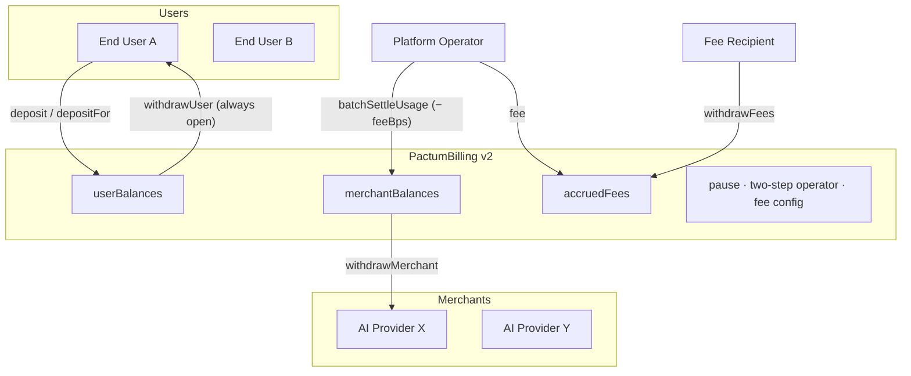

# Smart Contract — PactumBilling v2

Reference documentation for the PactumBilling Solidity contract (v2.0.0).

---

## Overview

PactumBilling is the on-chain component of the Pactum billing system. It manages USDC deposits from end-users, holds funds in escrow, and enables the platform operator to settle usage charges by moving funds from user balances to merchant balances in batches.

**Contract:** `PactumBilling.sol`
**Version:** `2.0.0` (readable on-chain via `VERSION()`)
**Solidity Version:** ^0.8.20 (compiled with standalone `solc`, EVM target `paris`)
**Chain:** Arc Testnet (Chain ID: `5042002`)
**Token:** USDC at `0x3600000000000000000000000000000000000000`

> [!IMPORTANT]
> USDC on Arc has dual views: native 18-decimal and ERC-20 6-decimal. This contract uses the **6-decimal ERC-20 view** for all operations and never touches `msg.value` or the native view.

## What changed in v2

| Area | v1 | v2 |
|---|---|---|
| Error handling | `require` strings | Custom errors (gas-cheaper, typed) |
| Reentrancy | CEI ordering only | CEI + `nonReentrant` guard on every state-changing entry point |
| Emergency stop | None | `setPaused(bool)` — deposits & settlements halt, **withdrawals stay open** |
| Operator hand-off | Single-tx `setOperator` | Two-step: `proposeOperator` → `acceptOperator` (target accepts) |
| Platform fee | Comment only, never implemented | `feeBps` (default 0, hard-capped at 20%) taken at settlement → `accruedFees` → `withdrawFees()` |
| Deposit on behalf | — | `depositFor(user, amount)` for applications funding their users |
| Stray value | Unreachable / stuck | `sweepSurplus()` capped at `balanceOf − totalOwed` — user funds mathematically unreachable |
| Accounting | Per-mapping only | `totalOwed` invariant + `totalLiabilities()` view |
| Deposit ordering | Interaction → effects | Checks-Effects-Interactions (credit ledger, then `transferFrom`) |
| Input validation | Partial | Zero-amount / zero-address / length-mismatch guards everywhere |
| Events | 4 | 10, incl. `UsageSettled(..., fee)`, operator/pause/fee lifecycle |

## Custody model (explicit)

The operator is a **trusted role**: `batchSettleUsage` can move any user balance to any merchant. v2 mitigations:

- `setPaused(true)` freezes deposits and settlements;
- `withdrawUser` **always stays open** (even paused) — every user can exit at any time;
- the fee is hard-capped on-chain at 20%;
- operator hand-off requires the target's acceptance, so the role can never be accidentally lost;
- user/merchant/fee funds are mathematically unreachable through `sweepSurplus`.

Full non-custody (per-user signed settlement tickets) remains a roadmap item — it requires off-chain engine changes.

---

## Contract Architecture



---

## State Variables

| Variable | Type | Description |
|---|---|---|
| `usdc` | `IERC20` `immutable` | USDC ERC-20 interface (6 decimals) |
| `operator` | `address` | Settlement & admin role |
| `pendingOperator` | `address` | Step 1 of the two-step hand-off |
| `feeRecipient` | `address` | Where accrued fees go |
| `feeBps` | `uint16` | Platform fee in bps of each settlement (0 = off, max 2 000) |
| `accruedFees` | `uint256` | Fees accumulated, awaiting `withdrawFees` |
| `paused` | `bool` | Emergency stop flag |
| `totalOwed` | `uint256` | user + merchant + fee liabilities — the non-sweepable core |
| `userBalances` | `mapping(address => uint256)` | Deposited USDC per user |
| `merchantBalances` | `mapping(address => uint256)` | Settled earnings per merchant |
| `VERSION` | `string` | `"2.0.0"` |
| `MAX_FEE_BPS` | `uint16` | `2_000` — on-chain fee ceiling |

---

## Functions

### User

#### `deposit(uint256 amount)`
Deposit USDC into your own channel balance (approve first). Paused-able.
**Reverts:** `ZeroAmount`, `ContractPaused`, `TransferFailed`. **Emits:** `Deposited(user, amount)`

#### `depositFor(address user, uint256 amount)`
Deposit on behalf of another user (application-funded channels). Same rules; `user != 0`.

#### `withdrawUser(uint256 amount)`
Withdraw unspent deposit. **Always available — even while paused.**
**Reverts:** `ZeroAmount`, `InsufficientUserBalance(available, required)`, `TransferFailed`. **Emits:** `UserWithdrawn(user, amount)`

### Merchant

#### `withdrawMerchant(uint256 amount)`
Withdraw settled earnings. **Always available — even while paused.**
**Reverts:** `ZeroAmount`, `InsufficientMerchantBalance`, `TransferFailed`. **Emits:** `MerchantWithdrawn(merchant, amount)`

### Operator

#### `batchSettleUsage(address[] users, address[] merchants, uint256[] amounts)`
Batch-settle metered usage. Each `amount` moves from the user's deposit to the merchant **minus `feeBps`**; the fee accumulates in `accruedFees`. All-or-nothing by design — the off-chain engine pre-checks every balance on-chain before submitting, and partial success would make reconciliation ambiguous.
**Reverts:** `NotOperator`, `ContractPaused`, `LengthMismatch`, `ZeroAmount`, `ZeroAddress`, `InsufficientUserBalance`.
**Emits:** `UsageSettled(user, merchant, amount, fee)` per item.

#### `setFee(uint16 bps, address recipient)`
Configure the platform fee (bps, 6-decimal base). `0` disables. Capped at `MAX_FEE_BPS`.
**Reverts:** `NotOperator`, `FeeTooHigh`, `ZeroAddress`. **Emits:** `FeeSet(bps, recipient)`

#### `withdrawFees()`
Transfer `accruedFees` to `feeRecipient`. **Emits:** `FeesWithdrawn(recipient, amount)`

#### `setPaused(bool value)`
Emergency brake for deposits + settlements. Withdrawals are deliberately exempt. **Emits:** `PauseSet(value)`

#### `proposeOperator(address newOperator)` / `acceptOperator()`
Two-step role hand-off: the current operator proposes, the target accepts.
**Reverts:** `NotOperator`, `ZeroAddress` / `NoPendingOperator`, `NotPendingOperator`.
**Emits:** `OperatorProposed`, `OperatorAccepted`

#### `sweepSurplus(address recipient, uint256 amount)`
Recover **stray value only** (e.g. forced native sends): capped at `usdc.balanceOf(this) − totalOwed`. User funds are unreachable here by construction.
**Reverts:** `NotOperator`, `ZeroAddress`, `InsufficientSurplus`. **Emits:** `SurplusSwept`

### Views

#### `totalLiabilities() → uint256`
`userBalances + merchantBalances + accruedFees`. The sweepable surplus is `usdc.balanceOf(this) − totalLiabilities()`.

---

## Events

| Event | Parameters | Description |
|---|---|---|
| `Deposited` | `user`, `amount` | USDC credited to a user channel |
| `UsageSettled` | `user`, `merchant`, `amount`, `fee` | One settled charge (fee may be 0) |
| `UserWithdrawn` | `user`, `amount` | User exit |
| `MerchantWithdrawn` | `merchant`, `amount` | Merchant payout |
| `OperatorProposed` / `OperatorAccepted` | — | Two-step hand-off lifecycle |
| `PauseSet` | `paused` | Emergency brake toggled |
| `FeeSet` | `feeBps`, `feeRecipient` | Fee configuration changed |
| `FeesWithdrawn` | `recipient`, `amount` | Platform fees paid out |
| `SurplusSwept` | `recipient`, `amount` | Stray value recovered |

---

## Arc Testnet Configuration

| Property | Value |
|---|---|
| Chain ID | `5042002` |
| RPC | `https://rpc.testnet.arc.io` |
| Explorer | `https://explorer.testnet.arc.io` |
| USDC Address | `0x3600000000000000000000000000000000000000` |
| USDC Decimals | `6` (ERC-20 view) |
| Faucet | [Circle Faucet](https://faucet.circle.com) |

> [!NOTE]
> Per the [Arc porting checklist](https://docs.arc.io/arc/tutorials/porting-contracts-to-arc): this contract uses only the 6-decimal ERC-20 USDC interface, never sweeps its native balance (only `sweepSurplus` above the liability invariant), checks every `transfer`/`transferFrom` return value, and uses no randomness. Circle blocklist reverts on `transfer` are surfaced as `TransferFailed`.

---

## Integrating with the contract

Everything below is live on the deployed v2 instance. Amounts are always
**6-decimal raw USDC units** — use `parseUnits(value, 6)`.

### End-user: deposit your own balance

```js
import { createWalletClient, createPublicClient, custom, http, parseUnits } from "viem";
import { arcTestnet } from "viem/chains";

const walletClient = createWalletClient({ chain: arcTestnet, transport: custom(window.ethereum) });
const publicClient = createPublicClient({ chain: arcTestnet, transport: http() });

// 1. one-time approval of the deposit amount
const approveHash = await walletClient.writeContract({
  address: USDC_ADDRESS,                       // 0x3600…0000 on Arc
  abi: [{ name: "approve", type: "function", stateMutability: "nonpayable",
          inputs: [{ name: "spender", type: "address" }, { name: "amount", type: "uint256" }],
          outputs: [{ type: "bool" }] }],
  functionName: "approve",
  args: [PACTUM_BILLING_ADDRESS, parseUnits("10", 6)],
});
await publicClient.waitForTransactionReceipt({ hash: approveHash });

// 2. credit your channel balance
const depositHash = await walletClient.writeContract({
  address: PACTUM_BILLING_ADDRESS,
  abi: [{ name: "deposit", type: "function", stateMutability: "nonpayable",
          inputs: [{ name: "amount", type: "uint256" }], outputs: [] }],
  functionName: "deposit",
  args: [parseUnits("10", 6)],
});
await publicClient.waitForTransactionReceipt({ hash: depositHash });
```

### End-user: withdraw your unused balance

No approval required — the contract sends USDC back to you. This always
works, even while deposits/settlements are paused:

```js
const hash = await walletClient.writeContract({
  address: PACTUM_BILLING_ADDRESS,
  abi: [{ name: "withdrawUser", type: "function", stateMutability: "nonpayable",
          inputs: [{ name: "amount", type: "uint256" }], outputs: [] }],
  functionName: "withdrawUser",
  args: [parseUnits("2", 6)],   // 2 USDC
});
await publicClient.waitForTransactionReceipt({ hash });
```

The hosted wallet page (`/wallet`) exposes exactly this flow — plus the
"Max available" shortcut, which is `userBalances − pendingUsage`.

### Application: fund a user's channel directly

```js
// from any wallet holding USDC (approve first, then):
await pactumBilling.writeContract({
  functionName: "depositFor",
  args: [userAddress, parseUnits("5", 6)],
});
```

### Merchant: withdraw settled earnings

```js
const hash = await walletClient.writeContract({
  address: PACTUM_BILLING_ADDRESS,
  abi: [{ name: "withdrawMerchant", type: "function", stateMutability: "nonpayable",
          inputs: [{ name: "amount", type: "uint256" }], outputs: [] }],
  functionName: "withdrawMerchant",
  args: [amount], // raw 6-decimal units
});
```

The dashboard's Payouts → Withdraw wraps this call.

### Read paths

```js
const userBalance = await pactumBilling.readContract({
  functionName: "userBalances", args: [userAddress],
});           // bigint, 6-decimal units
const version = await pactumBilling.readContract({ functionName: "VERSION" }); // "2.0.0"
const liabilities = await pactumBilling.readContract({ functionName: "totalLiabilities" });
// surplus (stray value) = usdc.balanceOf(contract) − liabilities
```

> [!WARNING]
> Never sweep the contract's raw balance on Arc — native USDC and the ERC-20
> USDC interface share one balance. Stray value leaves only through the
> operator's `sweepSurplus`, which is capped at `balanceOf − totalLiabilities`.

---

## Deployment & Migration (v1 → v2)

v2 changes storage layout and bytecode — it deploys as a **new contract**, not an upgrade-in-place:

1. `node compile.js` (done — artifact refreshed)
2. `node scripts/deploy.js` → prints the new address
3. Update `PACTUM_CONTRACT_ADDRESS` **and** `NEXT_PUBLIC_PACTUM_CONTRACT_ADDRESS` in `.env.local` (and `test_integration/.env`), then restart
4. Wind down v1: users call `withdrawUser` on the old contract and re-deposit to v2; merchants call `withdrawMerchant` on the old contract
5. Optional: configure the fee on v2 (`setFee`) — default is 0 (fee-free)

Until step 3, the running app continues to use the deployed v1 instance unchanged.

> [!NOTE]
> **Current deployment:** v2 is live at `0x4bab39e99d9bca6897d8b844f84fbe6b06d28509`
> (Arc Testnet, deployed 2026-09-19). Both apps point to it. The v1 instance at
> `0x84b739c9B1484EB4fc8C095f7a1dC396669EAeE3` remains withdrawable — users and
> merchants can pull their remaining v1 balances with `withdrawUser` /
> `withdrawMerchant` at any time.
