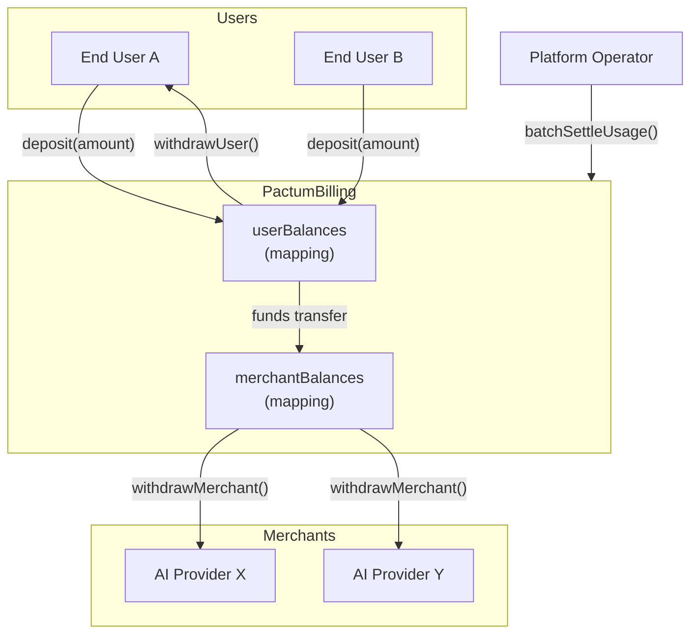
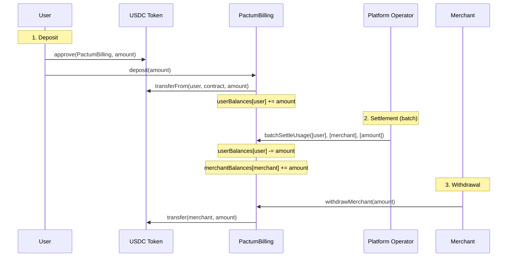

# Smart Contract — PactumBilling

Reference documentation for the PactumBilling Solidity contract.

---

## Overview

PactumBilling is the on-chain component of the Pactum billing system. It manages USDC deposits from end-users, holds funds in escrow, and enables the platform operator to settle usage charges by moving funds from user balances to merchant balances in batches.

**Contract:** `PactumBilling.sol`
**Solidity Version:** ^0.8.20
**Chain:** Arc Testnet (Chain ID: `5042002`)
**Token:** USDC at `0x3600000000000000000000000000000000000000`

> [!IMPORTANT]
> USDC on Arc has dual views: native 18-decimal and ERC-20 6-decimal. This contract uses the **6-decimal ERC-20 view** for all operations.

---

## Contract Architecture

---

## State Variables

| Variable | Type | Visibility | Description |
|---|---|---|---|
| `usdc` | `IERC20` | `public` | USDC token contract reference |
| `platformOperator` | `address` | `public` | Address authorized to call settlement functions |
| `userBalances` | `mapping(address => uint256)` | `public` | Deposited USDC per user |
| `merchantBalances` | `mapping(address => uint256)` | `public` | Earned USDC per merchant |

---

## Functions

### `deposit(uint256 amount)`

Allows a user to deposit USDC into the contract. The user must first call `approve()` on the USDC token contract, granting the PactumBilling contract an allowance.

| Parameter | Type | Description |
|---|---|---|
| `amount` | `uint256` | Amount of USDC to deposit (6-decimal precision) |

**Requirements:**
- `amount > 0`
- USDC `transferFrom` must succeed (requires prior `approve`)

**Emits:** `Deposited(user, amount)`

---

### `batchSettleUsage(address[] users, address[] merchants, uint256[] amounts)`

Settles off-chain usage charges in a single transaction. Moves funds from user balances to merchant balances. Only callable by the platform operator.

| Parameter | Type | Description |
|---|---|---|
| `users` | `address[]` | Array of user addresses being charged |
| `merchants` | `address[]` | Array of merchant addresses receiving payment |
| `amounts` | `uint256[]` | Array of USDC amounts to transfer |

**Requirements:**
- Caller must be `platformOperator`
- All arrays must have equal length
- Each `userBalances[user] >= amount`

**Emits:** `UsageSettled(user, merchant, amount)` for each settlement

---

### `withdrawUser(uint256 amount)`

Allows a user to withdraw their remaining unused USDC balance from the contract.

| Parameter | Type | Description |
|---|---|---|
| `amount` | `uint256` | Amount to withdraw |

**Requirements:**
- `userBalances[msg.sender] >= amount`

**Emits:** `UserWithdrawn(user, amount)`

---

### `withdrawMerchant(uint256 amount)`

Allows a merchant to withdraw their earned USDC from the contract.

| Parameter | Type | Description |
|---|---|---|
| `amount` | `uint256` | Amount to withdraw |

**Requirements:**
- `merchantBalances[msg.sender] >= amount`

**Emits:** `MerchantWithdrawn(merchant, amount)`

---

### `setOperator(address newOperator)`

Transfers the platform operator role to a new address. Only callable by the current operator.

| Parameter | Type | Description |
|---|---|---|
| `newOperator` | `address` | New operator address |

**Requirements:**
- Caller must be current `platformOperator`
- `newOperator != address(0)`

---

## Events

| Event | Parameters | Description |
|---|---|---|
| `Deposited` | `user (indexed)`, `amount` | User deposited USDC |
| `UsageSettled` | `user (indexed)`, `merchant (indexed)`, `amount` | Usage charge settled from user to merchant |
| `UserWithdrawn` | `user (indexed)`, `amount` | User withdrew unused balance |
| `MerchantWithdrawn` | `merchant (indexed)`, `amount` | Merchant withdrew earned fees |

---

## Interaction Flow

A typical lifecycle:

---

## Arc Testnet Configuration

| Property | Value |
|---|---|
| Chain ID | `5042002` |
| RPC | `https://rpc.testnet.arc.network` |
| Explorer | `https://testnet.arcscan.app` |
| USDC Address | `0x3600000000000000000000000000000000000000` |
| USDC Decimals | `6` (ERC-20 view) |
| Faucet | [Circle Faucet](https://faucet.circle.com) |
